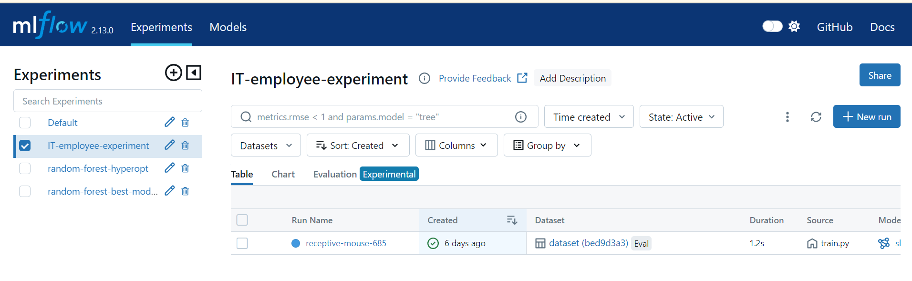
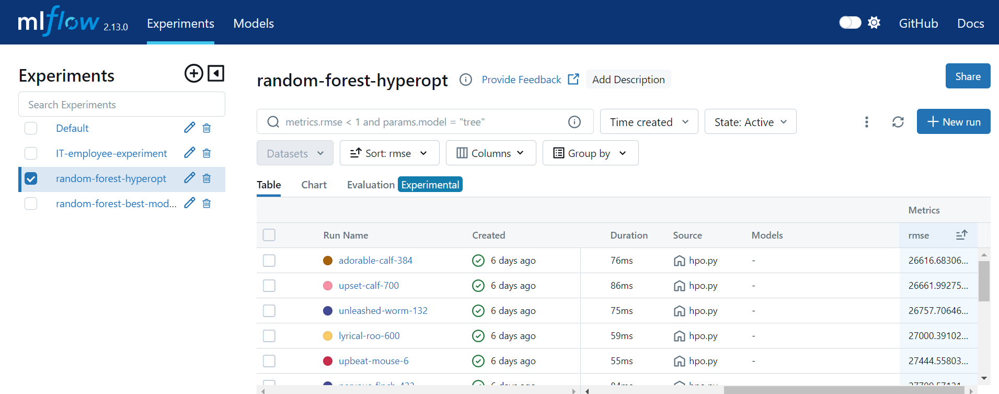
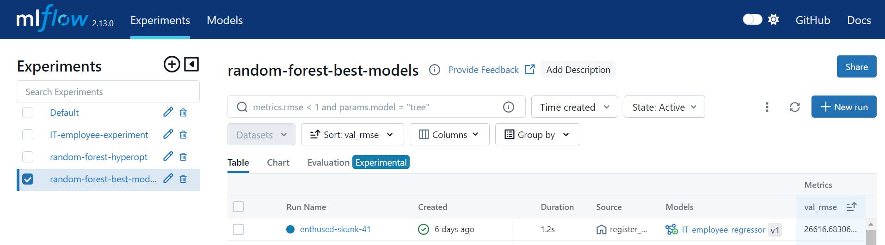
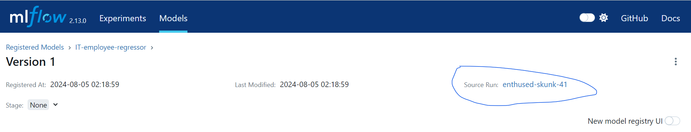
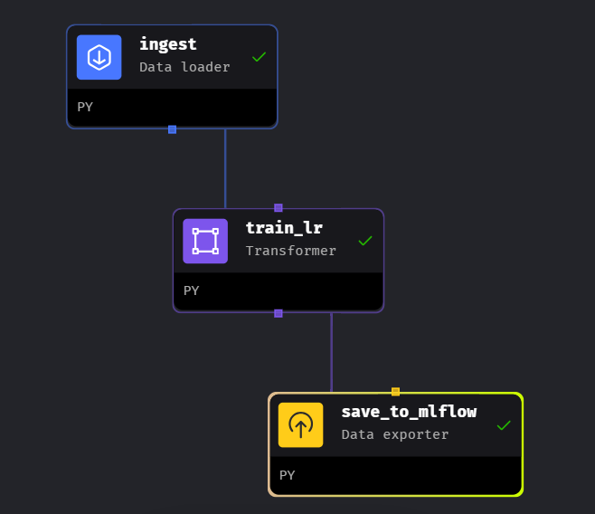
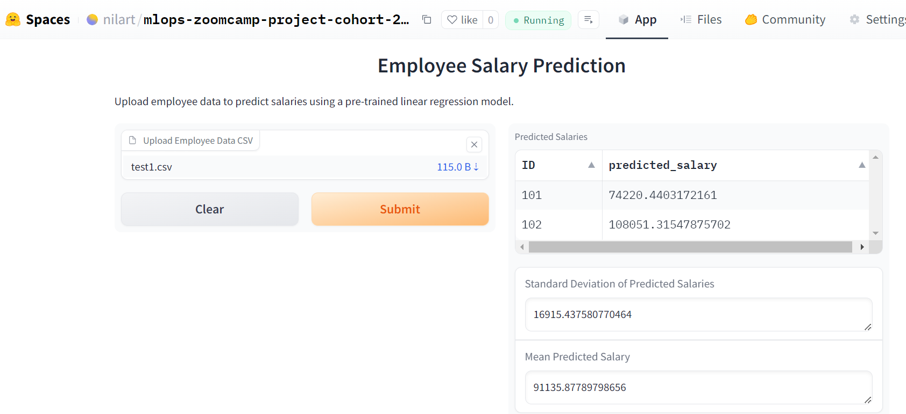
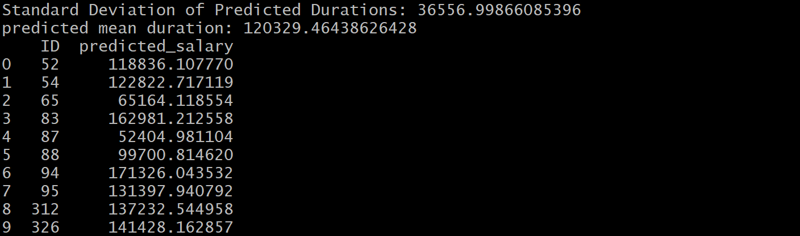
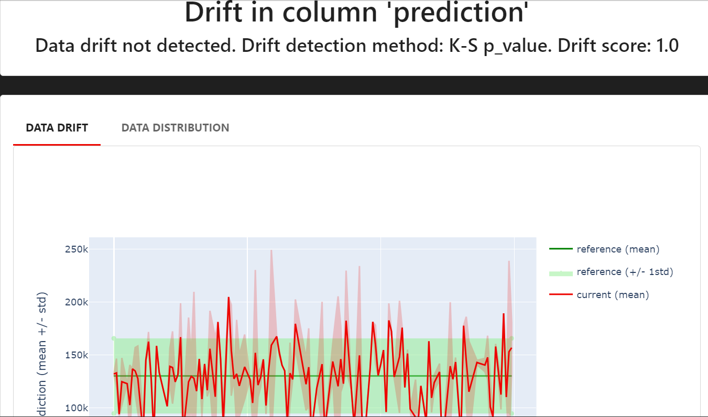
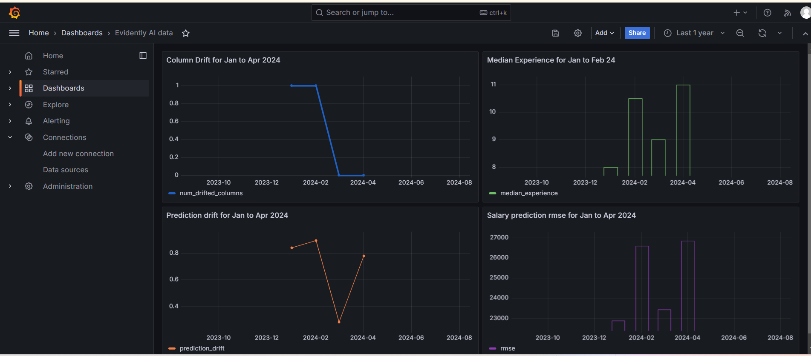

# mlops-zoomcamp-project-cohort-2024
## Description
This is my final project repo for  [MLOps Zoomcamp](https://github.com/DataTalksClub/mlops-zoomcamp/). 

It uses simple employee dataset from IT industry (presumably from India) and tries to predict salary. 
Prediction is mainly based on position & experience.

Dataset credit: https://www.kaggle.com/datasets/abhayayare/employee-data-simulation-it-industry

Here are more details about all the submission topics

## 1. Basic jupyter notebook 
[salary-prediction.ipynb](./salary-prediction.ipynb) is simple salary prediction jupyter notebook.
It will parse [employee_data.csv](./employee_data.csv) via `pandas` and use Linear Regression model from `scikit-learn`.
It will also plot simple histogram of salary distribution using `matplotlib`.

## 2. Experiment Tracking via mlflow
Switch to folder [experiment_tracking](./experiment_tracking)
It has some pre-run experiments. you can simply observe them.

Or You can run these experiments via foll. python scripts. 
### 2.1. Simple single 'RandomForestRegressor' experiment 
Run [train.py](./experiment_tracking/train.py)


### 2.2. Multiple experiments with hyperopt parameter tuning 
Run [hpo.py](./experiment_tracking/hpo.py)


### 2.3. Register best model with the lowest test RMSE in model registry  
Run [register_model.py](./experiment_tracking/register_model.py)




## 3. Pipeline orchestration via mage
Pipeline code is in folder [model_training_pipeline](./model_training_pipeline)

Here we use `mage` to set pipeline with foll. stages
### 3.1. ingest (Data loader)
Read employee data csv file
### 3.2. train_lr (Transformer)
Train linear regression model to predict salary 
### 3.3. save_to_mlflow (Data exporter)
Save model as mlflow artifact



## 4. Deploy salary prediction model
### 4.1 Deploy model on `huggingface` as web service

We have deployed model on huggingface spaces as a `gradio` webservice

Steps to use:

connect to webservice here: https://huggingface.co/spaces/nilart/mlops-zoomcamp-project-cohort-2024

you can upload employee data to be predicted in this format: [test1.csv](./deploy_model/test1.csv) 

Observe salary prediction


### 4.2 Deploy batch model via docker
This is a docker image.

It takes input: location of file which has Gender,Experience (Years),Position (Keep this file in local dir)

It ouputs: Predicted salary for all rows in input file 

Instructions to run:

Switch to folder [deploy_model](./deploy_model)

Pull docker container from public docker image at github registry

```bash
docker pull ghcr.io/nilarte/simple_salary_prediction
```

Note: You will need docker login to ghcr.io

ex:
```bash
docker login ghcr.io -u Your_Username
```

Or simply build local image using Dockerfile

Then run:
```bash
docker run -v $(pwd)/test1.csv:/app/test1.csv ghcr.io/nilarte/simple_salary_prediction test1.csv
```



## 5. Monitoring
Here we monitor key performance metrics of our employee salary predictionusing `Evidently`, 
including prediction drift, rmse and median employee experince . The results are visualized through `Grafana`.

Switch to folder [monitoring](./monitoring)
It has foll. 2 main parts

### 5.1. Observing Evidently metrics via jupyter notebook 
Here we have [baseline_model_employee_salary_data.ipynb](./monitoring/baseline_model_employee_salary_data.ipynb) 

It will log the following Evidently metrics inline in the notebook

ColumnDriftMetric(For column "prediction")

__DatasetDriftMetric__

__DatasetMissingValuesMetric__

__RegressionQualityMetric__

__ColumnQuantileMetric(Median of employee experience in dataset)__

Ex:


### 5.2. Monitoring Evidently metrics in Grafana dashboard"" 

Here we have "mock" split our employee data in to 4 month parts in 2024: 

Jan Feb March and April.

So that we can observe metrics chages over these 4 months in dashboard.

#### Instructions to observe monitoring dashboard:

```bash
docker-compose up
```
It will start postgres db to store our metrics.
It will also start Grafana ui at http://localhost:3000/

run [evidently_metrics.py](./monitoring/evidently_metrics.py)
This script will populate metrics data in postgres db.

Make sure you forward port 3000 (Grafana) and 5432 (Postgres) so they are both accesible

__Important limitation note:__ 

__Ideally postgres should be simply accesible via localhost.__

__However we could not make it work for now.__
__So we use host public ip / fqdn.__

__Hence please replace right public host ip (or fqdn) at this line:__ 
__[line in grafana_datasources.yaml to replace postgres host](./monitoring/config/grafana_datasources.yaml/#L21)__

__And restart grafana service to reflect these changes__

```bash
docker-compose restart grafana
```
Login to Grafana http://localhost:3000/

Open the Dashboard titled 'Evidently AI data' 



## Further improvements:
Use more extensive dataset, current one is with 400 rows.

Use cloud: Implement IAC on AWS via Terraform.

Use CI/CD.

Create unit tests.


 
